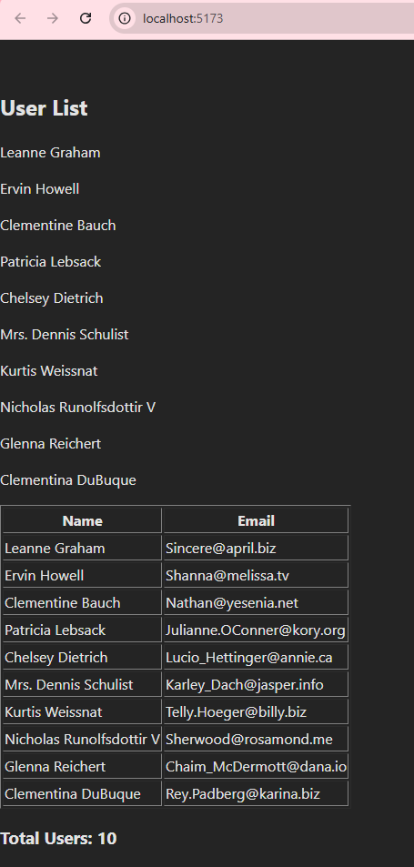

This project demonstrates three ways to fetch and display data in React:

- Simple Components – Using useState and useEffect directly inside the App component. Quick to see results, but logic is not easily reusable.

- Render Props (DataFetcher pattern) – Extracting data-fetching logic into a reusable DataFetcher component. Allows full control over UI via a render function.

- Custom Hooks – Modern and clean approach. Hooks allow you to reuse logic without wrapper components, keeping App simple and maintainable. This is the real-world standard.

## Project Setup

1. Clone the repository
   ```
   git clone <your-repo-url>
   cd <your-project-folder>
   ```
2. Install dependencies
   ```
   npm install
   ```
3. Start the development server
   ```
   npm run dev
   ```
   Open your browser at [localhost](http://localhost:5173) to see the app running.

# Project Structure

```
my-app/
├─ package.json          # Project dependencies and scripts
├─ tsconfig.json         # TypeScript configuration
├─ vite.config.ts        # Vite configuration
├─ .gitignore            # Files to ignore in Git
├─ src/
│  ├─ App.tsx            # Main App component
│  ├─ main.tsx           # Entry point, renders App
│  ├─ hooks/
│  │  └─ useFetch.ts     # Custom hook for fetching data
│  └─ components/
│     ├─ UserList.tsx    # Displays list of user names
│     ├─ UserTable.tsx   # Displays users in table
│     └─ UserSummary.tsx # Displays total user count
└─ public/
   └─ index.html         # HTML template

```

## Usage

Start with simple components to see results fast.

Move to Render Props (DataFetcher) for reusable logic.

Finally, convert to Custom Hooks for a clean, scalable solution.

## Key Takeaways

Simple components: Good for learning and small apps.

Render props: Flexible and reusable logic pattern.

Custom hooks: Preferred in modern React apps — fully composable and type-safe.

## API Used

[JSONPlaceholder API](https://jsonplaceholder.typicode.com/users)

## Notes

This project uses Vite + React + TypeScript.

Make sure your Node.js version is 20+ LTS for full compatibility.

.gitignore is included to avoid committing node_modules and build files.

## Local Developement Output

When running the application locally, the API returns the following response.This demonstrates successful data retrieval and processing:



# React + TypeScript + Vite

This template provides a minimal setup to get React working in Vite with HMR and some ESLint rules.

Currently, two official plugins are available:

- [@vitejs/plugin-react](https://github.com/vitejs/vite-plugin-react/blob/main/packages/plugin-react/README.md) uses [Babel](https://babeljs.io/) for Fast Refresh
- [@vitejs/plugin-react-swc](https://github.com/vitejs/vite-plugin-react-swc) uses [SWC](https://swc.rs/) for Fast Refresh

## Expanding the ESLint configuration

If you are developing a production application, we recommend updating the configuration to enable type aware lint rules:

- Configure the top-level `parserOptions` property like this:

```js
   parserOptions: {
    ecmaVersion: 'latest',
    sourceType: 'module',
    project: ['./tsconfig.json', './tsconfig.node.json'],
    tsconfigRootDir: __dirname,
   },
```

- Replace `plugin:@typescript-eslint/recommended` to `plugin:@typescript-eslint/recommended-type-checked` or `plugin:@typescript-eslint/strict-type-checked`
- Optionally add `plugin:@typescript-eslint/stylistic-type-checked`
- Install [eslint-plugin-react](https://github.com/jsx-eslint/eslint-plugin-react) and add `plugin:react/recommended` & `plugin:react/jsx-runtime` to the `extends` list
